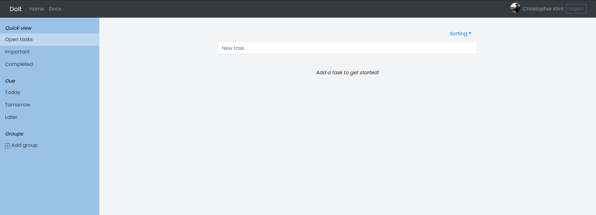
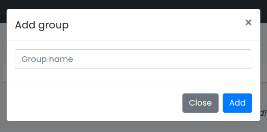
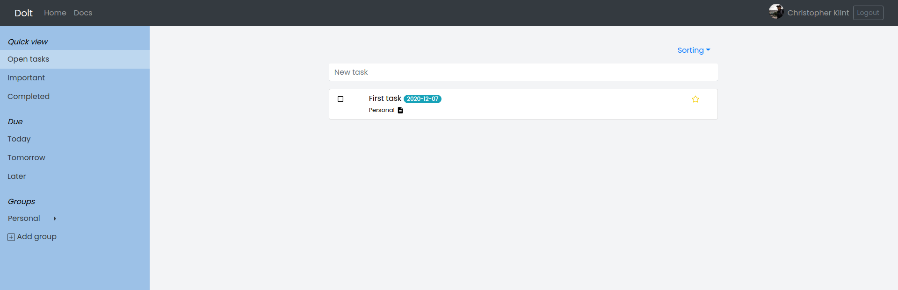
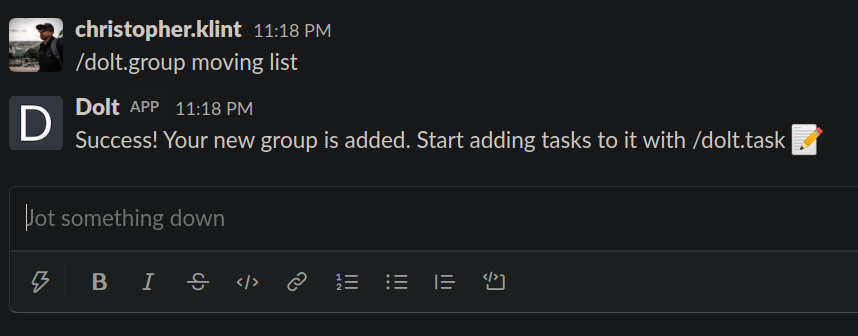
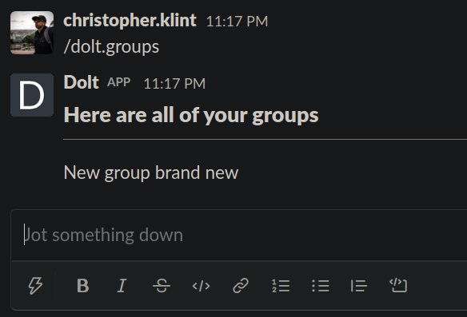
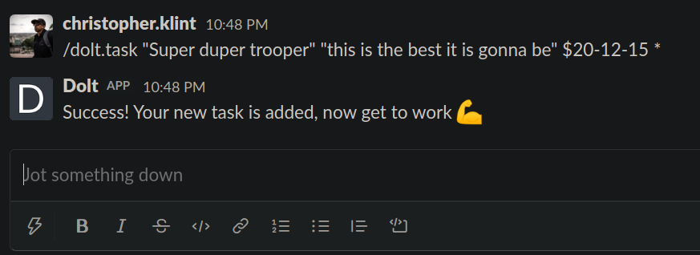

# What is [Dolt](dolt.christopherklint.com)?

[Dolt](dolt.christopherklint.com) is a task manager that is integrated with Slack through Oauth login functionality and slash commands for viewing adding tasks and groups.

I chose these features because I wanted to keep the web app fast and simple while still allowing for great practicality from a Slack workspace.

## Add Dolt to your Slack workspace

To take full advantage of the Slack integration, add Dolt to your Slack workspace

## Standard user flow of Dolt

Here is a step by step overview of the user flow for the app:

1. Arrive at the homepage and sign in with Slack
2. Login successful, reach the task manager dashboard
3. Create tasks with different attributes
4. Add these tasks to a group (user could have also created the groups first)
5. After getting familiar with the web app, user installs the Dolt app to their Slack workspace
6. User learns the slash commands
7. User can now view and add both tasks and groups with the right commands

## Screenshots

|                                     |                                      |
| ----------------------------------- | ------------------------------------ |
|        |      |
|    |    |
|  |  |
|        |    |

## [General docs](docs/docs.md)

## [Developer docs](docs/dev/dev_docs.md)
